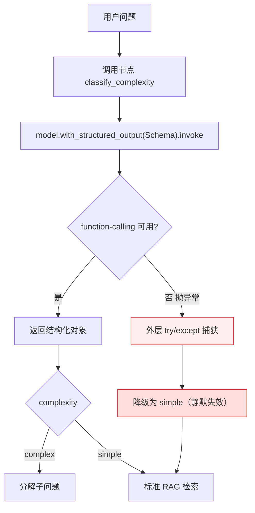
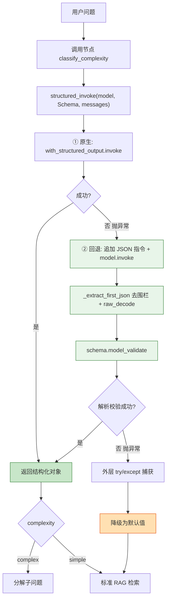

# `with_structured_output` 供应商兼容性改造报告

## 一、问题成因

项目中有 5 处通过 LangChain 的 `ChatOpenAI.with_structured_output(Schema)` 获取结构化输出，该方法**默认走 `method="function_calling"`**，即依赖供应商完整支持 OpenAI 的 tools / function-calling 协议。

当前项目接入的是「OpenAI 协议兼容端点」（火山方舟 ARK 等）。这类端点协议上兼容 `/v1/chat/completions`，但**不一定完整实现 function-calling**。一旦供应商不支持或实现有缺陷：

- `with_structured_output(...).invoke(...)` 会抛异常；
- 各调用点外层的 `try/except` 捕获后，**静默降级到默认值**。

后果是功能「看似没报错、实则失效」：

| 调用点 | 失效后默认值 | 实际影响 |
|---|---|---|
| 复杂度判定 `ComplexityResult` | `simple` | 复杂问题永远走单检索，不分解 |
| 子问题分解 `SubQuestions` | `[原问题]` | 复杂问题不分解 |
| 查询重写策略 `RewriteStrategy` | `step_back` | 永远只走退步策略，无 HyDE / complex |
| 联网抓取决策 `FetchDecision` | 取第一条结果 | 抓取决策失效 |
| 待办提取 `_ExtractedTodos` | `[]` | 待办永远提取不出 |

根因不是逻辑错误，而是**对供应商能力的隐式假设**：默认把「OpenAI 协议兼容」等同于「function-calling 可用」，而这两者并不等价。

## 二、解决方案：统一封装 + 双路兜底

新增自包含工具 `backend/llm_utils.py`，提供 `structured_invoke(model, schema, messages)`：

1. **首选原生路径**：`model.with_structured_output(schema).invoke(messages)` —— 支持 function-calling 的供应商仍享受原生 schema 约束。
2. **失败回退**：捕获异常后，在消息末尾追加「按给定 JSON Schema 输出纯 JSON」的指令，`model.invoke(...)` 取文本，剥离 ```json 围栏并容错解析首个 JSON 对象，用 `schema.model_validate(obj)` 校验返回。
3. **回退也失败**：抛异常向上，交由各调用点**既有的 `try/except` 兜底默认值**处理。

这样每个调用点的兜底语义完全不变，只是把「原生失败 → 直接降级」升级为「原生失败 → 先尝试解析恢复 → 仍失败才降级」，行为严格改进。

设计上与项目既有先例一致：grader 节点本就不用 structured output，而是手写「去围栏 + `raw_decode` 容错解析」（`backend/rag/pipeline.py` 的 `extract_grade_score`）。本次改造把该模式抽成可复用工具，自包含于 `llm_utils.py`，避免 websearch / chat 反向依赖 rag.utils。

### 改动清单

- **新增** `backend/llm_utils.py`：`structured_invoke` + `_extract_first_json` + `_message_content_to_text`。
- **替换 5 处调用**（各一行）：
  - `backend/rag/pipeline.py`：`RewriteStrategy`、`ComplexityResult`、`SubQuestions`
  - `backend/websearch/pipeline.py`：`FetchDecision`
  - `backend/chat/service.py`：`_ExtractedTodos`
- **不动**：5 个 Schema 类、grader 节点、模型初始化（`runtime.py` / `_get_*_model` / `_get_stepback_model`）、各调用点外层 `try/except` 与默认值。

## 三、解决前的数据流向

以「复杂度判定」为代表（其余 4 处同理）：

```
用户问题
  │
  ▼
classify_complexity(state)
  │
  ▼
model.with_structured_output(ComplexityResult).invoke([prompt])
  │
  ├── 供应商支持 function-calling ──► 返回 ComplexityResult 对象 ──► 走 complex/simple 分支 ✅
  │
  └── 供应商不支持 ──► 抛异常
                          │
                          ▼
                  外层 try/except 捕获
                          │
                          ▼
                  静默降级为 "simple" ❌（功能失效但不报错）
```

**问题**：原生路径与降级之间没有中间态。一旦 function-calling 不可用，结构化能力直接归零，且无任何提示。

### 解决前流程图



## 四、解决后的数据流向

```
用户问题
  │
  ▼
structured_invoke(model, ComplexityResult, [prompt])
  │
  ├── ① 原生路径：with_structured_output(...).invoke(...)
  │       │
  │       ├── 成功 ──► 返回 ComplexityResult ──► 走 complex/simple 分支 ✅
  │       └── 失败（抛异常）──► 进入回退
  │
  └── ② 回退路径：
          ├── 追加「输出纯 JSON」指令 + schema
          ├── model.invoke(...) 取文本
          ├── _extract_first_json：去围栏 + raw_decode 容错解析
          ├── schema.model_validate(obj) 校验
          │       ├── 校验成功 ──► 返回 ComplexityResult ──► 走分支 ✅
          │       └── 解析/校验失败 ──► 抛异常
          │                                   │
          ▼                                   ▼
                              外层 try/except 捕获 ──► 降级默认值（仅此情况才降级）
```

**改进点**：在「原生失败」与「降级」之间插入一道「提示 + 解析」的恢复层。function-calling 不可用但模型仍能按指令输出 JSON 时，结构化能力得以恢复；只有连 JSON 都解析不出时才走原来的兜底。

### 解决后流程图



## 五、改造前后对比

| 维度 | 改造前 | 改造后 |
|---|---|---|
| 原生 function-calling 可用 | ✅ 正常 | ✅ 正常（短路，零开销） |
| 协议兼容但 function-calling 不可用 | ❌ 静默降级，功能失效 | ✅ 回退提示+解析，多数情况恢复 |
| 模型连 JSON 都不输出 | 静默降级 | 降级（与改造前一致，兜底语义不变） |
| 兜底默认值 | 各点 try/except | 各点 try/except（不变） |
| 调用点改动量 | — | 每点一行 |
| 新增依赖 | — | 无（复用 pydantic / 标准库） |

## 六、验证情况

- `py_compile` 全部通过。
- 离线单元测试（mock 模型，脱离真实供应商）四条路径全部通过：原生短路、回退解析围栏 JSON、回退解析失败抛异常、`_extract_first_json` 多形态解析。
- 三个改动模块在 venv 下 import 正常，无循环依赖。
- 剩余真实端点联调（起服务跑 RAG / 联网 / 待办场景）需在运行环境验证。

## 七、涉及文件

- `backend/llm_utils.py`（新增）
- `backend/rag/pipeline.py`（3 处调用替换 + import）
- `backend/websearch/pipeline.py`（1 处调用替换 + import）
- `backend/chat/service.py`（1 处调用替换 + import）
